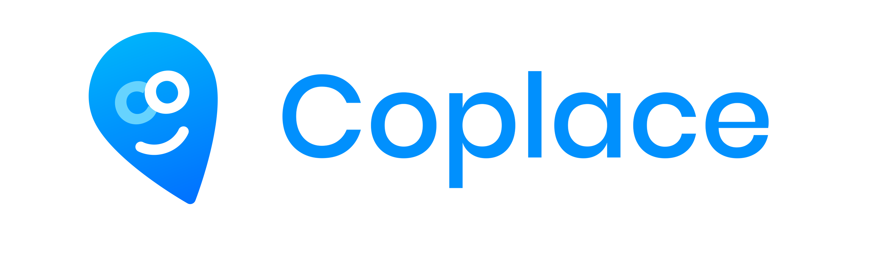

Este codigo representa a minha solução do teste proposto pela <a  href="https://www.gowork.com.br/">GoWork</a>

## 🚀 Sobre o projeto

Coplace é uma aplicação para gerenciamento de clientes de coworking desenvolvida como resolução ao [teste para a vaga de fullstack na empresa GoWork](https://github.com/ctg325/teste-gowork), desenvolvida com [React para o front-end](https://github.com/trylix/teste-gowork-frontend) e duas versões para o back-end, uma em [PHP com Laravel](https://github.com/trylix/teste-gowork-laravel) e outra em [NodeJS e Express](https://github.com/trylix/teste-gowork-nodejs).

Ambas versões do projeto para backend foram desenvolvidas seguindo os princípios de [TDD](https://pt.wikipedia.org/wiki/Test-driven_development). 👮🏻‍♂️

- [Tecnologias](#-tecnologias)
- [Instalação e execução](#-instalação-e-execução)
- [Próxima etapa](#-próxima-etapa)

## 🛸 Tecnologias

Esse projeto foi desenvolvido com:

- [React](https://pt-br.reactjs.org/)
- [Redux](https://redux.js.org/)
- [Redux Saga](https://redux-saga.js.org/)
- [Styled Components](https://styled-components.com/)

## 🛠 Instalação e execução

**Faça um clone desse repositório**

- Execute `yarn` para instalar sua dependências;
- Execute `yarn start` para iniciar o servidor;

## 📌 Próxima etapa

- Melhorias na listagem de funcionários
- Testes automatizados

---

Feito com ♥️ by Brendenson - [Github](https://github.com/trylix) | [LinkedIn](https://www.linkedin.com/in/dobrendenson)
